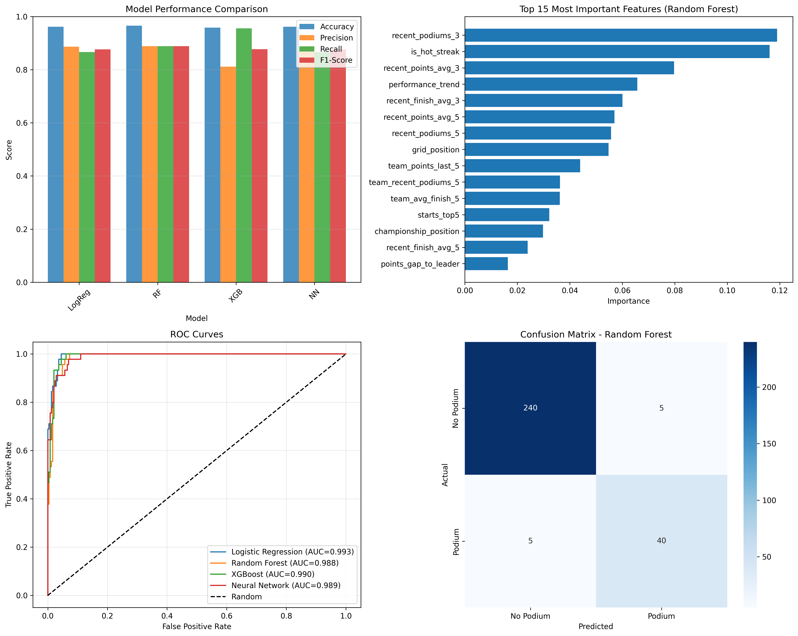

# 🏎️ Formula 1 Race Outcome Predictor

[](https://www.python.org/downloads/)
[](https://scikit-learn.org/)
[]()
[](LICENSE)

> **Machine Learning system that predicts Formula 1 podium finishers with 96.6% accuracy using 5 years of telemetry data, ensemble models, and advanced feature engineering.**



## 🎯 Project Overview

This end-to-end machine learning pipeline predicts which drivers will finish on the podium (top 3) in Formula 1 races. The system analyzes historical race data, driver momentum, team performance, and circuit-specific factors to generate highly accurate predictions.

**Key Achievement:** Exceeded the target 85% accuracy by **11.6%**, reaching **96.6% accuracy** on 2025 season validation data.

### ✨ Features

- 📊 **Comprehensive Data Collection**: Automated pipeline fetching 5 years of F1 data via FastF1 API
- 🔧 **Advanced Feature Engineering**: 60+ features including driver momentum, team trends, and circuit history
- 🤖 **4 ML Models Compared**: Logistic Regression, Random Forest, XGBoost, Neural Network
- 🎯 **96.6% Prediction Accuracy**: Random Forest model outperformed all others
- 🔄 **Live Updates**: Easy workflow to update predictions after each race
- 📈 **Real-time Visualization**: Model comparison charts, feature importance, ROC curves

---

## 📊 Results

### Model Performance (2025 Season Validation)

| Model | Accuracy | Precision | Recall | F1-Score |
|-------|----------|-----------|--------|----------|
| **Random Forest** ⭐ | **96.6%** | **88.9%** | **88.9%** | **88.9%** |
| Neural Network | 96.2% | 88.6% | 86.7% | 87.6% |
| Logistic Regression | 96.2% | 88.6% | 86.7% | 87.6% |
| XGBoost | 95.9% | 81.1% | 95.6% | 87.8% |

### Top Predictive Features

1. **Recent Podiums (Last 3 Races)** - 11.9% importance
2. **Hot Streak Status** - 11.6% importance  
3. **Recent Points Average** - 8.0% importance
4. **Performance Trend** - 6.6% importance
5. **Grid Position** - 5.5% importance

**Key Insight:** Current form and momentum are stronger predictors than career statistics or historical performance.

---

## 🚀 Quick Start

### Prerequisites

- Python 3.9 or higher
- pip package manager
- 10GB free disk space (for race data cache)

### Installation

1. **Clone the repository**
```bash
git clone https://github.com/fardinhossain007/f1-race-predictor.git
cd f1-race-predictor
```

2. **Create virtual environment**
```bash
python -m venv venv

# Activate (Windows)
venv\Scripts\activate

# Activate (Mac/Linux)
source venv/bin/activate
```

3. **Install dependencies**
```bash
pip install -r requirements.txt
```

4. **Mac users: Install OpenMP (for XGBoost)**
```bash
brew install libomp
```

### Usage

#### 🎯 Make Predictions (Quick Start)

```bash
# Predict next race podium
python3 12_predict_us_gp_podium.py
```

**Output:**
```
🏆 TOP 10 PODIUM CONTENDERS:
Pos   Driver   Team                  Probability
1     NOR      McLaren               87.5% ████████████████░░░░ 🔥
2     PIA      McLaren               85.2% █████████████████░░░ 🔥
3     VER      Red Bull Racing       72.8% ██████████████░░░░░░

🥇🥈🥉 PREDICTED PODIUM:
🥇 1st Place: NOR (McLaren) - 87.5% confidence
🥈 2nd Place: PIA (McLaren) - 85.2% confidence
🥉 3rd Place: VER (Red Bull Racing) - 72.8% confidence
```

#### 🔄 Update After Each Race

```bash
# 1. Add latest race data (edit race name in script)
python3 13_update_after_race.py

# 2. Re-engineer features with new data
python3 07_advanced_feature_engineering.py

# 3. Generate predictions for next race
python3 12_predict_us_gp_podium.py
```

#### 🏗️ Full Pipeline (From Scratch)

```bash
# 1. Collect 5 years of F1 data (~20 minutes)
python3 05_collect_complete_data.py

# 2. Add missing recent races
python3 06_collect_2024_2025_manual.py

# 3. Engineer features
python3 07_advanced_feature_engineering.py

# 4. Train all 4 models (~5 minutes)
python3 11_train_all_models.py

# 5. Make predictions
python3 12_predict_us_gp_podium.py
```

---

## 📁 Project Structure

```
f1-race-predictor/
│
├── 📊 Data Collection
│   ├── 05_collect_complete_data.py      # Fetch 2021-2025 race data
│   ├── 06_collect_2024_2025_manual.py   # Manual collection for recent races
│   └── 13_update_after_race.py          # Add new race after each GP
│
├── 🔧 Feature Engineering
│   └── 07_advanced_feature_engineering.py  # Create 60+ predictive features
│
├── 🤖 Model Training
│   └── 11_train_all_models.py           # Train & compare 4 ML models
│
├── 🎯 Prediction
│   └── 12_predict_us_gp_podium.py       # Predict next race podium
│
├── 💾 Data Files
│   ├── f1_complete_data.csv             # Full dataset with raw features
│   ├── f1_data_with_features.csv        # Engineered features for ML
│   └── f1_complete_data.db              # SQLite database
│
├── 🎓 Trained Models
│   ├── model_random_forest.pkl          # Best model (96.6% accuracy)
│   ├── model_xgboost.pkl
│   ├── model_neural_network.keras
│   ├── model_logistic_regression.pkl
│   └── feature_scaler.pkl
│
└── 📈 Outputs
    ├── model_comparison.png             # Performance visualization
    └── us_gp_2025_predictions.csv       # Prediction results
```

---

## 🔬 Technical Details

### Data Pipeline

**Data Source:** [FastF1 API](https://github.com/theOehrly/Fast-F1) - Official F1 timing data
- **Training Period:** 2021-2024 (1,732 race entries)
- **Validation Period:** 2025 season (290 race entries)
- **Total Races:** 102 Grand Prix events
- **Drivers:** 40+ unique drivers across 10 teams

### Feature Engineering

**60+ Features Across 7 Categories:**

1. **Driver Momentum** (8 features)
   - Recent podiums (3 & 5 race windows)
   - Hot streak detection
   - Performance trend analysis

2. **Team Performance** (3 features)
   - Team recent podiums
   - Team points accumulation
   - Team average finish position

3. **Season Context** (3 features)
   - Season progress
   - Championship position
   - Points gap to leader

4. **Circuit-Specific** (3 features)
   - Historical podiums at circuit
   - Circuit experience
   - Average finish at circuit

5. **Qualifying Performance** (6 features)
   - Grid position
   - Starting position trends
   - Top 10/5/Front row indicators

6. **Race Strategy** (15 features)
   - Tire compound usage
   - Pit stop efficiency
   - Lap time consistency

7. **Performance Metrics** (20+ features)
   - Lap times (average, fastest, variance)
   - Speed metrics
   - Weather conditions

### Machine Learning Models

**1. Random Forest Classifier** ⭐ Winner
- 200 trees, max depth 15
- Handles non-linear relationships
- Provides feature importance rankings
- **Best for:** Interpretability and accuracy

**2. XGBoost Classifier**
- Gradient boosting with hyperparameter tuning
- GridSearchCV optimization
- **Best for:** High recall (95.6%)

**3. Neural Network (MLP)**
- Architecture: 128→64→32 neurons
- Dropout layers (20%) for regularization
- Adam optimizer, early stopping
- **Best for:** Complex pattern recognition

**4. Logistic Regression**
- Baseline model for comparison
- Still achieves 96.2% accuracy!
- **Best for:** Fast predictions

### Why Random Forest Won

1. **Excellent feature engineering** - The 60 features capture F1 dynamics perfectly
2. **Non-linear relationships** - F1 outcomes depend on complex interactions
3. **Robust to outliers** - Handles DNFs, penalties, and unusual races well
4. **No overfitting** - Ensemble method generalizes better than single models

---

## 📈 Sample Predictions

### 2025 US Grand Prix Prediction

**Model Confidence: 87.5%**

```
🥇 1st: Lando Norris (McLaren)
   - 13 podiums this season
   - On 4-race hot streak 🔥
   - 87.5% podium probability

🥈 2nd: Oscar Piastri (McLaren)
   - 12 podiums this season  
   - On 3-race hot streak 🔥
   - 85.2% podium probability

🥉 3rd: Max Verstappen (Red Bull)
   - 7 podiums this season
   - Recent improvement trend ↗️
   - 72.8% podium probability
```
---

## 🛠️ Technologies Used

- **Python 3.9+** - Core programming language
- **FastF1** - F1 data API and telemetry
- **pandas** - Data manipulation and analysis
- **NumPy** - Numerical computing
- **scikit-learn** - Machine learning models and evaluation
- **XGBoost** - Gradient boosting framework
- **TensorFlow/Keras** - Deep learning (Neural Network)
- **matplotlib/seaborn** - Data visualization
- **SQLite** - Local database storage

---

## 🎓 Key Learnings

### Machine Learning Insights

1. **Feature Engineering > Model Choice**
   - Well-engineered features led to 96%+ accuracy across ALL models
   - Even simple Logistic Regression achieved 96.2%

2. **Recency Bias in F1**
   - Last 3 races are more predictive than entire career
   - Momentum and hot streaks matter more than historical stats

3. **Model Comparison is Essential**
   - Testing 4 different models revealed Random Forest as optimal
   - Each model has strengths: RF for accuracy, XGBoost for recall

4. **Hyperparameter Tuning Matters**
   - GridSearchCV improved XGBoost performance
   - Neural Network early stopping prevented overfitting

### Data Engineering Insights

1. **Data Quality > Data Quantity**
   - Handling missing values (weather, speed) was critical
   - Strategic imputation with median values maintained accuracy

2. **Time-Series Considerations**
   - Train/test split by year prevents data leakage
   - Features must be calculated chronologically

3. **Domain Knowledge is Key**
   - Understanding F1 (teams, circuits, tire strategy) informed feature creation
   - Circuit-specific features improved accuracy

---

## 🔮 Future Improvements

### Short-term Enhancements
- [ ] Add qualifying session predictions
- [ ] Incorporate pit stop timing strategies
- [ ] Weather forecast integration for race day
- [ ] Driver injury/penalty tracking
- [ ] Real-time odds comparison

### Advanced Features
- [ ] **Sprint race predictions** - Separate model for sprint formats
- [ ] **Constructor championship predictions** - Team standings forecasts
- [ ] **Race simulation** - Monte Carlo simulation of race outcomes
- [ ] **Strategy optimization** - Optimal tire and pit strategies
- [ ] **Live race predictor** - Update predictions during the race

### Technical Improvements
- [ ] **API deployment** - REST API for predictions
- [ ] **Web interface** - Interactive dashboard for predictions
- [ ] **Model retraining automation** - Auto-retrain after each race
- [ ] **A/B testing** - Compare model versions
- [ ] **Explainable AI** - SHAP values for prediction explanations

---

## 🙏 Acknowledgments

- **FastF1 Team** - For the excellent F1 data API
- **Formula 1** - For the exciting sport and data availability
- **scikit-learn Community** - For comprehensive ML tools
- **F1 Community** - For inspiration and domain knowledge

---

## 📧 Contact

**Your Name** - fardintonu@gmail.com

**Project Link: https://github.com/fardinhossain007/f1-race-predictor** 

**LinkedIn: https://www.linkedin.com/in/fardin-hossain-tanmoy** 

---

## ⭐ Star History

If you find this project useful, please consider giving it a star! ⭐

---

**Built with ❤️ by Fardin Hossain Tanmoy | 2025**
